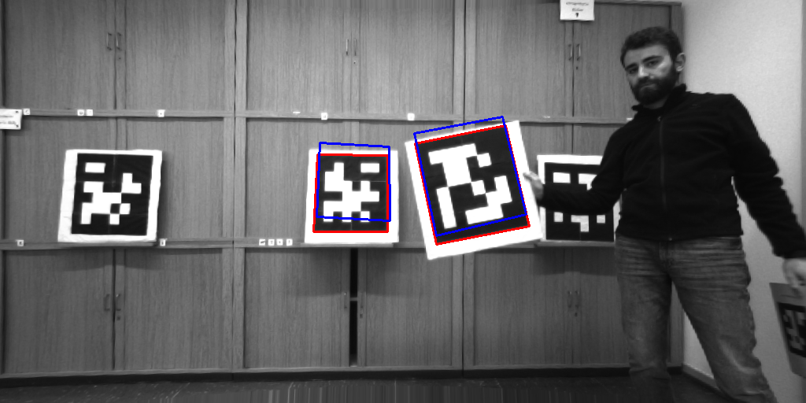
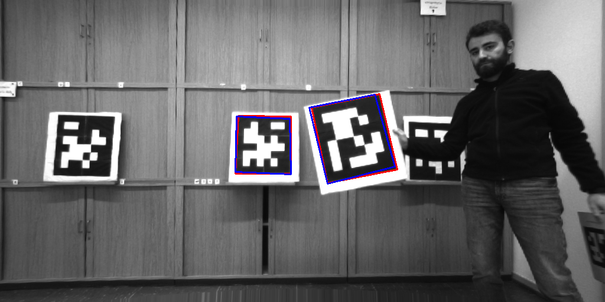

# SRRG2-APRILTAG-CALIBRATION

This repository contains a single catkin package, called `srrg2_apriltag_calibration`.
This package lives inside the `srrg2` multiverse.

Note that this package has internally the original AprilTag3 library inside (commit number `cad1009f9fbf457e2a5393c0fb6c8a05042a0611`).
**This is entirely developed and engineered by AprilRobotics**. Further information can be found in the [official AprilTag3 repository](https://github.com/AprilRobotics/apriltag).

## What is this?
AprilTag3-based calibration for 3D LiDAR and monocular camera.
The core idea is quite simple:
 - project lidar cloud to get an intensity image
 - use AprilTag3 library to detect tag on the intensity image
 - use AprilTag3 library to detect tag on the camera image
 - if a tag is detected in both sensors, you have associations between 3D points (lidar) and 2D ones (camera)
 - setup a LS posit solver to minimize the reprojection error between 3D and 2D points.

The things that you need are the following:
 - lidar cloud and lidar specifications (to do the projection)
 - rectified camera images and camera matrix.

## How to build
The `srrg2_apriltag_calibration` package is developed using our `srrg2` framework.
All our software is tested both with Ubuntu 18.04 and 16.04 (GCC 5 and 7), still the remaining of this guide refers to Ubuntu 18.04.
Please follow this guide to build and run `srrg2_apriltag_calibration` on your machine:

1. initialize the `srrg2` Catkin workspace following the guide [here](https://github.com/srrg-sapienza/srrg2_core/tree/master/srrg2_core). As indicated in the aforementioned guide, we suggest to have a directory in which you clone all the `srrg2` repositories (referred here as `SRRG2_SOURCE_ROOT`) and a directory that contains the Catkin workspace (referred here as `SRRG2_WS_ROOT`)

2. clone all the `srrg2` dependencies of this package
```bash
cd <SRRG2_SOURCE_ROOT>
git clone https://github.com/srrg-sapienza/srrg2_cmake_modules.git # basic cmake-modules
git clone https://github.com/srrg-sapienza/srrg2_core.git # core data-structures and
git clone https://github.com/srrg-sapienza/srrg2_solver.git # solver (both for registration and global optimization)
git clone https://github.com/srrg-sapienza/srrg2_qgl_viewport.git # opengl viewport
```

3. clone this repository
```bash
cd <SRRG2_SOURCE_ROOT>
git clone https://github.com/srrg-sapienza/srrg2_apriltag_calibration.git
```

4. link all the required packages in your Catkin workspace
```bash
cd <SRRG2_WS_ROOT>/src
ln -s <SRRG2_SOURCE_ROOT>/srrg2_cmake_modules .
ln -s <SRRG2_SOURCE_ROOT>/srrg2_core/srrg2_core .
ln -s <SRRG2_SOURCE_ROOT>/srrg2_solver/srrg2_solver .
ln -s <SRRG2_SOURCE_ROOT>/srrg2_qgl_viewport/srrg2_qgl_viewport .
ln -s <SRRG2_SOURCE_ROOT>/srrg2_apriltag_calibration .
```

5. build using Catkin
```bash
cd <SRRG2_WS_ROOT>
catkin build srrg2_apriltag_calibration
```

6. [OPTIONAL] build unit-tests using catkin
```bash
cd <SRRG2_WS_ROOT>
catkin build srrg2_apriltag_calibration --catkin-make-args tests
```

## How to run
This package provides two main executables:
 1. `app_offline_calibration`: reads data from either a bag or a `.boss` file and performs offline calibration. The output is the trasform `T_lidar_in_camera` written as `[x y z qx qy qz]` - i.e. translation and unit quaternion. To execute this app type:
 ```sh
 rosrun srrg2_apriltag_calibration app_offline_calibration -h
 ```

 2. `app_extrinsic_visualization`: given the output file of the offline calibration, it visually shows the reprojections of the lidar points in the camera image, to visually evaluate the data. To execute this app type:
 ```sh
 rosrun srrg2_apriltag_calibration app_extrinsic_visualization -h
 ```

## Example of performances
Example of calibration output. In red is reported the tag detection from camera data, in blue the reprojection of the lidar detection.

##### Reprojected detection from initial guess:


##### Reprojected detection from estimated transform:


## Contributors
* Irvin Aloise

## Acknowledgments
Thanks to the [IPB team](https://www.ipb.uni-bonn.de/) for their support during the development of this package :D

## License
BSD 3.0
